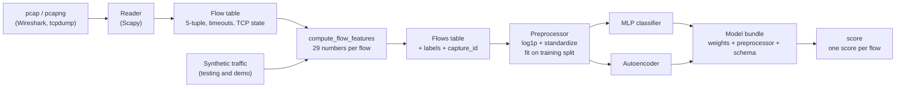

# neural-ids — Architecture

Status: design for phase 1. The sizes below are the planned defaults; task T12 updates this
document to match the finished code.

## What it is
An open-source pipeline and two neural networks that flag suspicious network flows in
Wireshark and tcpdump captures (pcap and pcapng). The repository ships the architecture and
the code, not a trained model: you train it on your own captures (or on public datasets), then
use it to score new captures.

## Usage (the target for phase 1)

```bash
uv run neural-ids demo                                   # whole pipeline on synthetic data, no captures needed

uv run neural-ids build-dataset my-captures/ --out flows.csv          # captures → labeled flows
uv run neural-ids train --flows flows.csv --mode autoencoder \
    --group-column capture_id --out models/my-network                # or --mode classifier
uv run neural-ids score new-capture.pcapng --bundle models/my-network --top 20
```

## Components



| Component | Module | Task |
|---|---|---|
| Feature contract (names, units, edge cases, schema version) | `docs/features.md`, `schema.py` | T01 |
| Shared feature function and synthetic traffic | `features.py`, `synthetic.py` | T02 |
| Preprocessing (fit on the training split only) | `preprocess.py` | T03 |
| Split loader (contract check), metrics, gradient check | `splits.py`, `metrics.py`, `gradcheck.py` | T04 |
| Models from scratch in NumPy | `models/`, `nn/` | T04–T07 |
| Models in PyTorch, model bundle, `train` command | `torch_models.py`, `bundle.py`, `cli.py` | T08–T09 |
| Capture reader and flow table | `extract.py` | T10 |
| Datasets from folders of captures | `dataset.py` | T11 |
| `score` and `demo` commands | `cli.py` | T12 |

## Data representation: flows
A neural network needs the same number of inputs for every example, but a capture is a stream
of packets of different sizes. The pipeline groups packets into **flows**: all packets of one
conversation in both directions, keyed by the 5-tuple (source IP, destination IP, source port,
destination port, protocol). "Forward" is the direction of the first packet. A TCP flow ends on
RST, or after both FINs and the final ACK; any flow also ends after 120 s of silence or 1800 s
in total.
Non-IP packets and all IP fragments are skipped and counted in the extractor summary. The
exact rules, edge cases, and schema version are in `docs/features.md` and `schema.py`.

The extractor (T10) and the synthetic generator (T02) both hand one flow to
`compute_flow_features` as `FlowPackets`: aligned arrays of timestamps, directions, IP lengths,
and TCP flag bytes (header bit values, FIN 0x01 … URG 0x20), in processing (file) order and
never sorted. `compute_flow_features` applies the effective-time rule `t_eff = max(t, t_last)`
itself, so every data source shares one implementation of it.

Each flow becomes 29 numbers (feature contract v1), all taken from packet headers and timing:
protocol (one-hot), duration, packets and IP-layer bytes in each direction, packet-length
statistics, time between packets, TCP flag counts, rates, the backward/forward byte ratio, and
the destination-port class (one-hot). IP addresses, MAC addresses, exact ports, timestamps,
and flow IDs are kept as metadata for labels and reports, and are never model inputs.

## Preprocessing (T03)
`preprocess.py` turns a flows table into `(n, 29)` float32 inputs, the same way for every table:
1. `validate_flows` first: a table that breaks the contract is rejected, not silently scaled.
   It also guarantees finite values >= 0, so `log1p` is always defined.
2. Select `schema.FEATURE_NAMES` in contract order (metadata and labels never pass).
3. `log1p` on the 21 features that are not one-hot (`LOG_FEATURES`; counts, bytes, durations,
   gaps, rates, the byte ratio, and packet lengths, which reach ~64 KB in captures taken with
   segmentation offload). Each one's reason is next to it in the code.
4. Standardize those 21 columns with the training mean and std. A column that is constant in
   training (by scikit-learn's floating-point rule, not `std == 0`) gets scale 1, so one URG
   flag at scoring time becomes log1p(1) ≈ 0.69 (its distance to the training value) instead
   of an enormous number. The 8 one-hot columns stay 0/1.

Every learned value (means, scales, the class list) comes from the training split only. The
fitted preprocessor is saved as self-contained JSON (schema version, feature order, the log1p
and standardized lists, means, scales); `load` refuses another schema version or feature order,
and a loaded preprocessor never reads the module constants, so later code changes cannot
change an old model's inputs.

Targets: `y_binary = is_attack`; `y_class` indexes `class_names = ("normal", sorted attack
labels in train)`, with 0 for every `is_attack == 0` row. Arrays are saved with `np.savez`
(class names as fixed-width Unicode, readable with `allow_pickle=False`), together with the
feature order, the schema version, the data source (`SYNTHETIC` for generated tables), the
SHA-256 of the input CSV (`input_sha256`), and `flow_id` per row (metadata, never in `X`) for the label-noise ceiling and error lookup. The split is
stratified by label and random; `split` is the one function to replace with a split by capture
or time window for real captures (phase 2). The command also counts val/test rows whose feature
vector has an exact copy in train: harmless for independent synthetic flows, a warning sign
with real captures.

## Baselines and evaluation (T04)
Every model reads its data with `splits.load_split`, which loads with `allow_pickle=False` and
refuses arrays whose `schema_version` or `feature_names` differ from the code.
`metrics.py` computes accuracy, precision, recall, F1, and the confusion matrix with attack as
the positive class; an undefined ratio (for example, precision when nothing is flagged) is 0,
as in scikit-learn with `zero_division=0`.

`uv run python -m neural_ids.train_baselines` trains three NumPy models on the training split
(the validation split is only measured; the test split is not loaded):
- `MajorityClassifier`: the "free" score (recall 0 when most flows are normal).
- `Perceptron`: step activation and the perceptron rule, applied per mini-batch.
- `LogisticRegression`: one sigmoid neuron trained with mini-batch gradient descent on a
  logit-based BCE (`BCEWithLogitsLoss` form, so no log(0)); zero initial weights, so the first
  loss is ln 2. It is the building block of the MLP in T05.

For SYNTHETIC data, after training, the evaluation step reads `flipped_flow_ids` from
`synthetic.json` and prints the label-noise ceiling of the validation split (recall and
precision of a perfect model scored against the noisy labels). Synthetic flow IDs repeat in
every run, so the ceiling is computed only when `synthetic.json`'s `csv_sha256` equals the
arrays' `input_sha256`; otherwise the command says they come from different runs and skips it.

## The networks

### MLP classifier (supervised)

| Layer | Shape | Activation |
|---|---|---|
| Input | 29 features | — |
| Dense | 29 → 64 | ReLU |
| Dense | 64 → 32 | ReLU |
| Output | 32 → 1 (attack or not) or 32 → K (which attack) | sigmoid or softmax, inside the loss |

- Loss: binary cross-entropy on logits, or cross-entropy with optional class weights.
- Optimizer: SGD with momentum (NumPy version), AdamW (PyTorch version); early stopping on
  validation loss; optional dropout and weight decay.
- Size: 4,033 parameters for the binary model. Flow features are few and tabular, so a small
  MLP is the standard choice; a bigger network mostly memorizes the training captures.

### Autoencoder (unsupervised)

| Layer | Shape | Activation |
|---|---|---|
| Input | 29 features | — |
| Dense | 29 → 16 | ReLU |
| Dense (bottleneck) | 16 → 4 | ReLU |
| Dense | 4 → 16 | ReLU |
| Output | 16 → 29 | linear |

- Trained on normal flows only, with mean squared error between input and output.
- Anomaly score: the reconstruction error of a flow. Alert threshold: by default the 99th
  percentile of the errors on normal validation flows.
- Size: 1,121 parameters. The 4-unit bottleneck forces the network to learn the typical
  structure of normal traffic instead of copying its input.

## Training modes: what data you need

| Mode | Captures you provide | Labels | Output per flow |
|---|---|---|---|
| `classifier` | normal traffic and each attack type | folder names | attack probability or attack class |
| `autoencoder` | normal traffic only | none | anomaly score |

The autoencoder is the easy start for anyone: capture your own normal traffic and train. It
flags what is unusual on your network, which is not always malicious. The classifier needs
examples of each attack, for example from your own isolated lab or from public datasets.

## Bringing your own data

```text
my-captures/
  normal/        *.pcap, *.pcapng   → label "normal"
  portscan/      *.pcap, *.pcapng   → label "portscan"
  bruteforce/    *.pcap, *.pcapng   → label "bruteforce"
```

- One label per folder. `normal` is reserved for benign traffic.
- `build-dataset` records every capture's SHA-256 and counts in `dataset_manifest.json`.
- Training splits by capture, not by flow: flows from one capture are strongly related, so a
  random split would put near-copies in both training and test data and inflate the results.
- Only use captures you were authorized to make.

## Design decisions

| Decision | Why |
|---|---|
| One feature function for every data source | Features computed differently in training and in use break models with no error message (training–serving skew). |
| No identifiers as inputs | Models learn shortcuts such as "this IP was the attacker"; a study of CIC-IDS2017 found exactly this with IP addresses and timestamps. |
| Packet sizes at the IP layer | Link layers differ between Ethernet, Wi-Fi, and `tcpdump -i any` captures. |
| Correct TCP termination (RST, both FINs + final ACK) | CICFlowMeter ended flows at the first FIN, so the rest of each connection became extra fake flows ("TCP appendices"): 25.9% of all flows in CIC-IDS2017 (Engelen, Rimmer, Joosen, WTMC 2021). |
| Split by capture | Honest results on correlated data. |
| Model bundle = `state_dict` + JSON (schema version, feature order, preprocessor, threshold, checksum) | No pickle; wrong or corrupted files fail loudly. |
| Streaming reader behind a small interface | Constant memory, and a faster backend (for example dpkt) can replace Scapy for large public datasets. |

## Security and privacy
- Payload bytes are never stored, logged, or printed; outputs show aggregates, and flow tables
  can replace IP addresses with keyed hashes (HMAC-SHA256) with `--anonymize`.
- Captures are git-ignored and must be authorized by the network owner.
- The code only reads and writes capture files; tests fail if anything tries to send a packet.

## Limitations
- Per-flow features miss attacks spread over many flows, such as slow scans and distributed
  brute force. Host-window features are planned. One low-and-slow brute-force connection
  (one failed login) looks almost the same as a person who mistyped a password once; the
  synthetic data reproduces this overlap at high difficulty.
- IP fragments are skipped (v1 does no reassembly), so deliberately fragmented traffic such as
  `nmap -f` shows up only in the skipped-fragment count.
- A model trained on one network often performs worse on another; evaluate on captures from a
  different network or day before trusting it.
- Synthetic data only tests the code. Detection quality depends on the captures you train on.
- `data/processed/synthetic.json` records how a synthetic table was made. Its
  `flipped_flow_ids` is the answer key to the label noise: it is used only to compute the
  perfect-model ceiling for a split, and is never read by preprocessing or training. Its
  `csv_sha256` ties it to the exact CSV, so a stale json cannot score newer arrays.
- This is a learning and portfolio project, not a production intrusion detection system.

## Extension points
- New features: extend the contract and bump `SCHEMA_VERSION`; old bundles then refuse the new
  input instead of failing silently.
- New models: sequence models (for example a 1D CNN or a GRU) over the sizes and timing of the
  first N packets of each flow.
- Public datasets: adapters that label mixed captures with time windows and IP addresses.

## References
- G. Engelen, V. Rimmer, W. Joosen, "Troubleshooting an Intrusion Detection Dataset: the
  CICIDS2017 Case Study," WTMC 2021.
  https://intrusion-detection.distrinet-research.be/WTMC2021/ —
  "TCP appendices are alarmingly present,
  making up 25.9 percent of the entire dataset".
